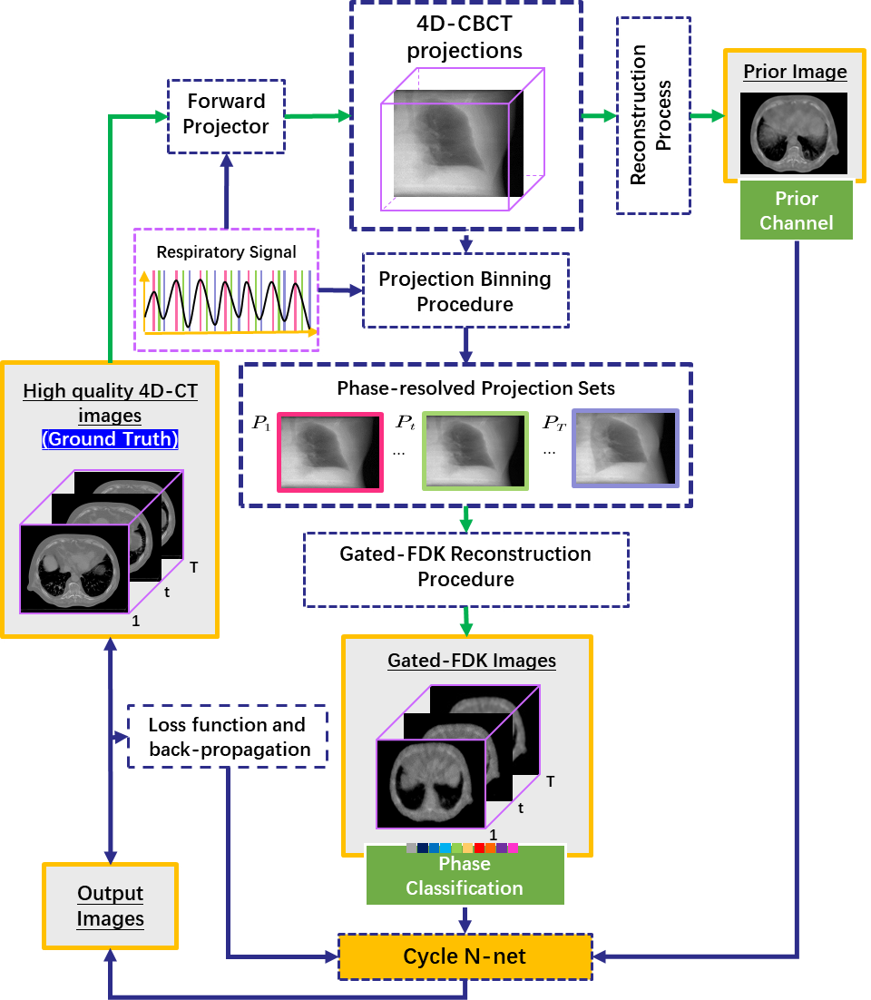

**Training Dataset Preparation**

A sample of training data consists of three parts, FDK reconstruction, the prior
reconstructed image, and the ground truth image, as shown in the Table below.

The generation of FDK reconstruction, prior image (motion-affected
reconstruction) and the corresponding ground truth is illustrated in the figure
below.

