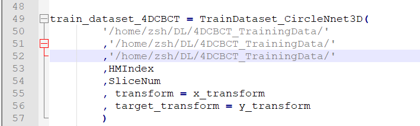
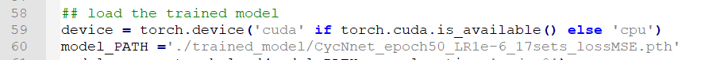

# N-Net and CycNet

By [Shaohua Zhi](https://www.researchgate.net/profile/Shaohua-Zhi "Shaohua Zhi"), [Marc Kachelrieß](https://bit.ly/3bgnBbA "Marc Kachelrieß") and [Xuanqin Mou](https://bit.ly/3uSjR82 "Xuanqin Mou").

This is a PyTorch implementation of our paper.

## Installation
Please refer to requirment.txt for all required packages.

## Dataset
The training data set comes from the [4D-Lung Cancer Imaging Archive (TCIA)](https://wiki.cancerimagingarchive.net/display/Public/4D-Lung "4D-Lung Cancer Imaging Archive (TCIA)").

Please download the some sets of this data as you like for training. For this work, we used the following data ###HM10395 to train the network: ### = [100, 101, 102, 103, 104, 108, 109, 110, 111, 112, 113, 114, 115, 116, 117, 118, 119].

For the evaluation data set, several slices of XCAT phantom are provided here (url), while we cannot share the real patient data.

Prepare data sets of 4D-CBCT/4D-CT as described in DatasetPreparation.md.

## Training
Read the training tutorial for details.

- For the N-net:
Conduct python main_train_Nnet.py to train the N-Net model.
```
File TrainDataset_Nnet.py illustrates the training dataset.
File model_Nnet.py illustrates the architecture model of N-Net.
Please edit some settings in main_train_Nnet.py:
Path of Training data set:
```

|                                                                                                                                                                                                                                                                                                                                                                                                                                                                                                                                                                                                                                                                                                                                                                                                                                                                                                                                                                                                                                       |
|----------------------------------------------------------------------------------------------------------------------------------------------------------------------------------------------------------------------------------------------------------------------------------------------------------------------------------------------------------------------------------------------------------------------------------------------------------------------------------------------------------------------------------------------------------------------------------------------------------------------------------------------------------------------------------------------------------------------------------------------------------------------------------------------------------------------------------------------------------------------------------------------------------------------------------------------------------------------------------------------------------------------------------------------------------------------|
| Fig. 1. The architecture of the proposed N-Net and CycN-Net. (a) the architecture of N-Net; (b) the cycle component in CycN-Net; (c) the convolution block or prior convolution block (Blcok/pBlock) in every layer of N-Net and 2-8 layers in CycN-Net. Each block consists of two convolutions, two PReLU functions; (d) the concatenation unit (C) that generates a stack of feature maps using different inputs. Note that unit C only activates input2 in N-Net while makes full use of three inputs in CycN-Net; (e) add unit (Add) that fuses the feature maps from inputs without changing the size; (f) transposed convolution unit (Tconv) that consists of two transpose convolutions and two PReLU functions; (g) final convolutional unit (FinalConv), consisting of two convolutions and two PReLU functions (FinalConv). By switching the single component in (a) into the cycle component in (b) with activating all the inputs in the C unit, the network comes to CycN-Net. The arrows in the left part of the figure denote different operations. |

|                |
|---------------------------------------------------------------|
| Fig. 2. The analysis of the 3DBlock in the proposed CycN-Net. |

**Installation**

Please refer to requirment.txt for all required packages.

## Dataset

## The training dataset is from 4D-Lung dataset of Cancer imaging (url). 

## Please download the some sets of this data as you like for training. For this work, we used the following data \#\#\#HM10395 to train the network: \#\#\# = [100, 101, 102, 103, 104, 108, 109, 110, 111, 112, 113, 114, 115, 116, 117, 118, 119].

## For the evaluation dataset, several slices of XCAT phantom are provided here (url), while we can’t share the real patient data.

Prepare datasets of 4D-CBCT/4D-CT as described in **DatasetPreparation.md**.

## Training

Read the training tutorial for details.

-   For N-net:

Conduct **python main\_train\_Nnet.py** to train N-Net model.

File **TrainDataset_Nnet.py** illustrates the training dataset.

File **model_Nnet.py** illustrates the architecture model of N-Net.

Please edit some settings in **main_train_Nnet.py:**

1.  **Path of Training Dataset：**


1.  **Trained Model:**


Memory requirement:

1GPU: NVIDIA GeForce RTX 2080 (8GB)

-   For CycN-Net:

Conduct **python main\_train\_CycNnet.py** to train CycN-Net model.

File **TrainDataset_CycNnet.py** illustrates the training dataset.

File **model\_CycNnet.py** illustrates the architecture model of CycN-Net.

Please edit some settings in **main_train_CycNnet.py:**

1.  **Path of Training Dataset:**



1.  **Trained Model:**


**Memory requirement:**

3GPUs: NVIDIA GeForce GTX 1080 (8GB)

## Evaluation

For N-Net:

Conduct **python main_test_Nnet_XCAT.py** to test the trained model.

File **TestingDataset_Nnet_XCAT.py** illustrates the testing dataset.

Please edit some settings in **main_test_Nnet_XCAT.py:**

**Load trained model:**


**Set save path:**


**Load the testing dataset:**


For CycN-Net:

Conduct **python main_test_CycNnet_XCAT.py** to test the trained model.

File **TestingDataset_CycNnet_XCAT.py** illustrates the testing dataset.

Please edit some settings in **main_test\_CycNnet_XCAT.py:**

**Load trained model:**



**Load the testing dataset:**


**Set save path:**


The detailed parameters of both N-Net and CycN-Net are displayed in Table I and
II.

Table I Parametric Structure for All the Layers in the N-Net

| **Layer**              | **Conv1** **PriorConv1**      | **Conv2** **PriorConv2**      | **Conv3** **PriorConv3**      | **Conv4** **PriorConv4**    | **Conv5** **PriorConv5**      | **Conv6** **PriorConv6**      | **Conv7** **PriorConv7**      | **Conv8** **PriorConv8**          |
|------------------------|-------------------------------|-------------------------------|-------------------------------|-----------------------------|-------------------------------|-------------------------------|-------------------------------|-----------------------------------|
| Convolution            | 5\*5@8 PReLU 5\*5@8 PReLU     | 3\*3@16 PReLU 3\*3@16 PReLU   | 3\*3@32 PReLU 3\*3@32 PReLU   | 3\*3@64 PReLU 3\*3@64 PReLU | 3\*3@128 PReLU 3\*3@128 PReLU | 3\*3@256 PReLU 3\*3@256 PReLU | 3\*3@512 PReLU 1\*1@512 PReLU | 1\*1@512 PReLU 1\*1@512 PReLU     |
| Max-pooling            | 2\*2                          | 2\*2                          | 2\*2                          | 2\*2                        | 2\*2                          | 2\*2                          | 2\*2                          | ---                               |
| Feature Output         | 504\*504@8                    | 248\*248@16                   | 120\*120@32                   | 56\*56@64                   | 24\*24@128                    | 8\*8@256                      | 2\*2@512                      | 1\*1@512                          |
| **Layer**              | **Tconv1**                    | **Tconv2**                    | **Tconv3**                    | **Tconv4**                  | **Tconv5**                    | **Tconv6**                    | **Tconv7**                    | **FinalConv**                     |
| Up-sampling            | 2\*2                          | 2\*2                          | 2\*2                          | 2\*2                        | 2\*2                          | 2\*2                          | 2\*2                          | ---                               |
| Transposed Convolution | 1\*1@512 PReLU 3\*3@512 PReLU | 3\*3@256 PReLU 3\*3@256 PReLU | 3\*3@128 PReLU 3\*3@128 PReLU | 3\*3@64 PReLU 3\*3@64 PReLU | 3\*3@32 PReLU 3\*3@32 PReLU   | 3\*3@16 PReLU 3\*3@16 PReLU   | 5\*5@16 PReLU 5\*5@16 PReLU   | 1\*1@16 PReLU 3\*3@8 PReLU 1\*1@1 |
| Feature Output         | 4\*4@512                      | 12\*12@256                    | 28\*28@128                    | 60\*60@64                   | 124\*124@32                   | 252\*252@16                   | 512\*512@16                   | 512\*512@1                        |

Table II Parametric Structure for All the Layers in the CycN-Net

| **Layer**              | **Conv1** **PriorConv1**      | **Conv2** **PriorConv2**      | **Conv3** **PriorConv3**      | **Conv4** **PriorConv4**    | **Conv5** **PriorConv5**    | **Conv6** **PriorConv6**      | **Conv7** **PriorConv7**      | **Conv8** **PriorConv8**          |
|------------------------|-------------------------------|-------------------------------|-------------------------------|-----------------------------|-----------------------------|-------------------------------|-------------------------------|-----------------------------------|
| Convolution            | 5\*5\*3@4 PReLU 5\*5@4 PReLU  | 3\*3@8 PReLU 3\*3@8 PReLU     | 3\*3@16 PReLU 3\*3@16 PReLU   | 3\*3@32 PReLU 3\*3@32 PReLU | 3\*3@64 PReLU 3\*3@64 PReLU | 3\*3@128 PReLU 3\*3@128 PReLU | 3\*3@256 PReLU 1\*1@256 PReLU | 1\*1@256 PReLU 1\*1@256 PReLU     |
| Max-pooling            | 2\*2                          | 2\*2                          | 2\*2                          | 2\*2                        | 2\*2                        | 2\*2                          | 2\*2                          | ---                               |
| Feature Output         | 504\*504@4                    | 248\*248@8                    | 120\*120@16                   | 56\*56@32                   | 24\*24@64                   | 8\*8@128                      | 2\*2@256                      | 1\*1@256                          |
| **Layer**              | **Tconv1**                    | **Tconv2**                    | **Tconv3**                    | **Tconv4**                  | **Tconv5**                  | **Tconv6**                    | **Tconv7**                    | **FinalConv**                     |
| Up-sampling            | 2\*2                          | 2\*2                          | 2\*2                          | 2\*2                        | 2\*2                        | 2\*2                          | 2\*2                          | ---                               |
| Transposed Convolution | 1\*1@512 PReLU 3\*3@512 PReLU | 3\*3@256 PReLU 3\*3@256 PReLU | 3\*3@128 PReLU 3\*3@128 PReLU | 3\*3@64 PReLU 3\*3@64 PReLU | 3\*3@32 PReLU 3\*3@32 PReLU | 3\*3@16 PReLU 3\*3@16 PReLU   | 5\*5@16 PReLU 5\*5@16 PReLU   | 1\*1@16 PReLU 3\*3@8 PReLU 1\*1@1 |
| Feature Output         | 4\*4@512                      | 12\*12@256                    | 28\*28@128                    | 60\*60@64                   | 124\*124@32                 | 252\*252@16                   | 512\*512@16                   | 512\*512@1                        |
